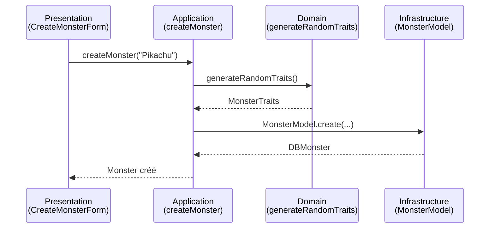

# Clean Architecture

Le projet Tamagotcho implémente les principes de **Clean Architecture** pour garantir une séparation claire des responsabilités et une testabilité optimale.

## Vue d'ensemble de l'architecture

```
┌──────────────────────────────────────────────────────┐
│                  Presentation Layer                   │
│              (src/components/, src/app/)              │
│                                                        │
│  - Composants React (UI uniquement)                   │
│  - Pages Next.js (orchestration)                      │
│  - Aucune logique métier                              │
└────────────────────┬─────────────────────────────────┘
                     │ Dépend de ↓
┌────────────────────┴─────────────────────────────────┐
│                 Application Layer                     │
│                  (src/app/, src/actions/)             │
│                                                        │
│  - Routing Next.js                                    │
│  - Server Actions                                     │
│  - Coordination des flux                              │
└────────────────────┬─────────────────────────────────┘
                     │ Dépend de ↓
┌────────────────────┴─────────────────────────────────┐
│                   Domain Layer                        │
│            (src/types/, src/services/)                │
│                                                        │
│  - Types et interfaces métier                         │
│  - Logique métier pure (génération de monstres)       │
│  - Règles de validation                               │
└────────────────────┬─────────────────────────────────┘
                     │ Dépend de ↓
┌────────────────────┴─────────────────────────────────┐
│                Infrastructure Layer                   │
│              (src/db/, src/lib/)                      │
│                                                        │
│  - Connexion MongoDB                                  │
│  - Configuration Better Auth                          │
│  - APIs externes                                      │
└──────────────────────────────────────────────────────┘
```

## Règle de dépendance

:::danger Règle fondamentale
Les dépendances doivent **toujours pointer vers l'intérieur** (UI → Application → Domain). Jamais dans le sens inverse !
:::

### ✅ BON
```typescript
// Composant UI dépend du type du domaine
import type { MonsterTraits } from '@/types/monster'

function PixelMonster({ traits }: { traits: MonsterTraits }) {
  // OK : Presentation → Domain
}
```

### ❌ MAUVAIS
```typescript
// ❌ Le domaine ne doit JAMAIS dépendre de l'UI
// src/types/monster.ts
import { PixelMonster } from '@/components/pixel-monster'
// ERREUR : Domain → Presentation
```

## Couche 1 : Presentation Layer

### Responsabilités
- Affichage de l'interface utilisateur
- Gestion des événements utilisateur
- Aucune logique métier

### Structure de fichiers
```
src/
├── components/
│   ├── button.tsx              # Composant réutilisable
│   ├── header.tsx              # Navigation
│   ├── hero-section.tsx        # Section héro
│   ├── monsters/
│   │   ├── pixel-monster.tsx   # Affichage d'un monstre
│   │   └── monster-card.tsx    # Carte de monstre
│   └── dashboard/
│       ├── stats-card.tsx      # Carte de statistiques
│       └── user-profile-card.tsx
└── app/
    ├── page.tsx                # Page d'accueil
    ├── dashboard/
    │   └── page.tsx            # Page dashboard
    └── creature/
        └── [id]/
            └── page.tsx        # Page détail créature
```

### Bonnes pratiques

```typescript
// ✅ Composant pur sans logique métier
function MonsterCard({ monster }: { monster: DBMonster }) {
  return (
    <div className="monster-card">
      <h3>{monster.name}</h3>
      <PixelMonster traits={JSON.parse(monster.traits)} />
      <p>Level {monster.level}</p>
    </div>
  )
}
```

```typescript
// ❌ Éviter la logique métier dans les composants
function MonsterCard({ monster }: { monster: DBMonster }) {
  // ❌ MAUVAIS : Logique de calcul dans le composant
  const nextLevel = Math.floor(monster.level * 1.5 + 10)
  const requiredXP = nextLevel * 100
  
  // ❌ MAUVAIS : Appel direct à la DB
  const { data } = await fetch('/api/monsters')
  
  return <div>...</div>
}
```

## Couche 2 : Application Layer

### Responsabilités
- Coordination des flux applicatifs
- Gestion du routing
- Server Actions Next.js

### Structure de fichiers
```
src/
├── app/
│   ├── layout.tsx              # Layout racine
│   └── api/
│       └── auth/
│           └── [...all]/
│               └── route.ts    # Routes d'authentification
└── actions/
    ├── monsters.actions.ts     # Actions pour les monstres
    └── navigation.actions.ts   # Actions de navigation
```

### Server Actions

```typescript
// src/actions/monsters.actions.ts
'use server'

import { auth } from '@/lib/auth'
import { MonsterModel } from '@/db/models/monster.model'
import { generateRandomTraits } from '@/services/monsters/monster-generator'

export async function createMonster(name: string) {
  // Coordination : Auth + Service + DB
  const session = await auth()
  if (!session?.user?.id) {
    throw new Error('Non authentifié')
  }

  const traits = generateRandomTraits() // Service du domaine
  
  const monster = await MonsterModel.create({
    name,
    traits: JSON.stringify(traits),
    ownerId: session.user.id,
    level: 1,
    state: 'happy'
  })

  return monster
}
```

## Couche 3 : Domain Layer

### Responsabilités
- Types et interfaces métier
- Logique métier pure (sans dépendances externes)
- Règles de validation

### Structure de fichiers
```
src/
├── types/
│   ├── monster.ts              # Types et constantes des monstres
│   ├── components.ts           # Types des composants
│   └── forms/
│       └── create-monster-form.ts
└── services/
    └── monsters/
        └── monster-generator.ts # Génération de traits
```

### Logique métier pure

```typescript
// src/services/monsters/monster-generator.ts
import type { MonsterTraits } from '@/types/monster'

// ✅ Fonction pure : pas d'effets de bord
export function generateRandomTraits(): MonsterTraits {
  const randomPalette = pastelColors[Math.floor(Math.random() * pastelColors.length)]
  const randomAntenna = antennaColors[Math.floor(Math.random() * antennaColors.length)]
  const randomEye = eyeColors[Math.floor(Math.random() * eyeColors.length)]

  return {
    bodyColor: randomPalette[0],
    accentColor: randomPalette[1],
    eyeColor: randomEye,
    antennaColor: randomAntenna,
    bobbleColor: randomAntenna,
    cheekColor: adjustColorOpacity(randomPalette[0], 0.7),
    bodyStyle: bodyStyles[Math.floor(Math.random() * bodyStyles.length)],
    eyeStyle: eyeStyles[Math.floor(Math.random() * eyeStyles.length)],
    antennaStyle: antennaStyles[Math.floor(Math.random() * antennaStyles.length)],
    accessory: accessories[Math.floor(Math.random() * accessories.length)]
  }
}
```

### Types et constantes

```typescript
// src/types/monster.ts
export const MONSTER_STATES = ['happy', 'sad', 'angry', 'hungry', 'sleepy'] as const
export type MonsterState = typeof MONSTER_STATES[number]

export const DEFAULT_MONSTER_LEVEL = 1
export const DEFAULT_MONSTER_STATE: MonsterState = MONSTER_STATES[0]

export interface MonsterTraits {
  bodyColor: string
  accentColor: string
  eyeColor: string
  antennaColor: string
  bobbleColor: string
  cheekColor: string
  bodyStyle: MonsterStyle
  eyeStyle: EyeStyle
  antennaStyle: AntennaStyle
  accessory: AccessoryStyle
}
```

## Couche 4 : Infrastructure Layer

### Responsabilités
- Connexion aux bases de données
- Configuration des services externes
- Implémentation des adapters

### Structure de fichiers
```
src/
├── db/
│   ├── index.ts                # Connexion MongoDB
│   └── models/
│       └── monster.model.ts    # Modèle Mongoose
└── lib/
    ├── auth.ts                 # Configuration Better Auth
    ├── auth-client.ts          # Client d'auth
    └── utils/
        ├── date.utils.ts
        ├── label.utils.ts
        └── monster.utils.ts
```

### Connexion à la base de données

```typescript
// src/db/index.ts
import mongoose from 'mongoose'

const MONGODB_URI = process.env.MONGODB_URI!

if (!MONGODB_URI) {
  throw new Error('MONGODB_URI manquant dans les variables d\'environnement')
}

let cached = global.mongoose

if (!cached) {
  cached = global.mongoose = { conn: null, promise: null }
}

export async function connectDB() {
  if (cached.conn) {
    return cached.conn
  }

  if (!cached.promise) {
    cached.promise = mongoose.connect(MONGODB_URI).then((mongoose) => {
      return mongoose
    })
  }

  cached.conn = await cached.promise
  return cached.conn
}
```

### Modèles de base de données

```typescript
// src/db/models/monster.model.ts
import mongoose from 'mongoose'
import type { DBMonster } from '@/types/monster'

const monsterSchema = new mongoose.Schema({
  name: { type: String, required: true },
  level: { type: Number, default: 1 },
  traits: { type: String, required: true }, // JSON serialized
  state: { type: String, required: true },
  ownerId: { type: String, required: true },
  createdAt: { type: Date, default: Date.now },
  updatedAt: { type: Date, default: Date.now }
})

export const MonsterModel = mongoose.models.Monster || mongoose.model<DBMonster>('Monster', monsterSchema)
```

## Flux de données typique

### Création d'un monstre



### Code correspondant

```typescript
// 1. Presentation Layer (UI)
function CreateMonsterForm() {
  async function handleSubmit(e: FormEvent) {
    e.preventDefault()
    const name = formData.get('name') as string
    await createMonster(name) // Appel à l'Application Layer
  }
}

// 2. Application Layer (Coordination)
'use server'
export async function createMonster(name: string) {
  const traits = generateRandomTraits() // Domain Layer
  const monster = await MonsterModel.create({ /* ... */ }) // Infrastructure
  return monster
}

// 3. Domain Layer (Logique métier)
export function generateRandomTraits(): MonsterTraits {
  // Logique pure sans dépendances
}

// 4. Infrastructure Layer (Persistance)
export const MonsterModel = mongoose.model(/* ... */)
```

## Bénéfices de cette architecture

### ✅ Testabilité
Chaque couche peut être testée indépendamment :

```typescript
// Test de la logique métier (Domain Layer)
describe('generateRandomTraits', () => {
  it('devrait générer des traits valides', () => {
    const traits = generateRandomTraits()
    expect(traits.bodyColor).toMatch(/^#[0-9A-F]{6}$/i)
    expect(['round', 'square', 'tall', 'wide']).toContain(traits.bodyStyle)
  })
})
```

### ✅ Maintenabilité
Changement de base de données facile (MongoDB → PostgreSQL) sans toucher au domaine :

```typescript
// Seul l'Infrastructure Layer change
// Domain et Presentation restent identiques
```

### ✅ Réutilisabilité
La logique métier peut être réutilisée dans différents contextes :

```typescript
// Même service utilisé par :
// - API Route
// - Server Action
// - Script CLI
import { generateRandomTraits } from '@/services/monsters/monster-generator'
```

## Checklist d'implémentation

Avant d'ajouter du nouveau code :

- [ ] La couche Presentation ne contient que de l'UI ?
- [ ] La logique métier est dans le Domain Layer ?
- [ ] Les dépendances pointent vers l'intérieur ?
- [ ] Aucun appel direct à la DB depuis l'UI ?
- [ ] Les types métier sont dans `src/types/` ?
- [ ] Les Server Actions coordonnent sans logique métier ?

## Ressources

- [Clean Architecture by Robert C. Martin](https://blog.cleancoder.com/uncle-bob/2012/08/13/the-clean-architecture.html)
- [Principes SOLID](./solid-principles)
- [Next.js Server Actions](https://nextjs.org/docs/app/building-your-application/data-fetching/server-actions-and-mutations)
